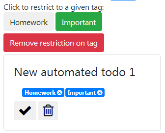

# First lab : TODO

## Student

## DEMO HERE : http://p1.advancedsoftwareengineering.space:5000/static/todos

Julien Amacher

## Source files

	* Server : Written in NodeJS, is in the **server** folder
	* Client : Written in AngularJS v2, is in the **client** folder

## Server

Prepare the server by download the dependencies :
	npm install

Then run the server :
	node .

## Database

I chose MySQL as database engine.

Import the **db/mpd.sql** as root to create the 3 required tables as well as the database.

## Client

	npm install -g @angular/cli
	ng server --open

If you would like to change the server address, modify the **todomvc\src\app\services\config.service.ts** file.

## Tests

A small test script written in Mocha can be run:
cd server
npm test

## User manual

With ng server executed and the test procedure ran, go to http://localhost:4200/todos . The following todos are displayed :

To add one todo, specify a new title an click Add :

The new todo is created :

To assign a tag to a todo, click on Tags and select the tag you want :

The tag is then linked and appears :

To remove a tag from a todo, click on it.

To delete a todo, click on the following icon :

To mark a todo as completed, click on the following icon :

You can also reorder the todos by clicking on the following icons :

If you'd like to restrict displaying todos to only these with a given tag, simply click on it :

Click on "Remove restriction on tag" once you are done.

To edit a title, first click on it, specify the new title and click outside the edit box to save it :

To manage tags, click the "Manage tags" link at the top of the page.
Here, you can:
* Delete a tag by clicking on the corresponding icon
* Edit the name of the tag by clicking on it
* Add a new tag by specifying a name and by clicking on Add

